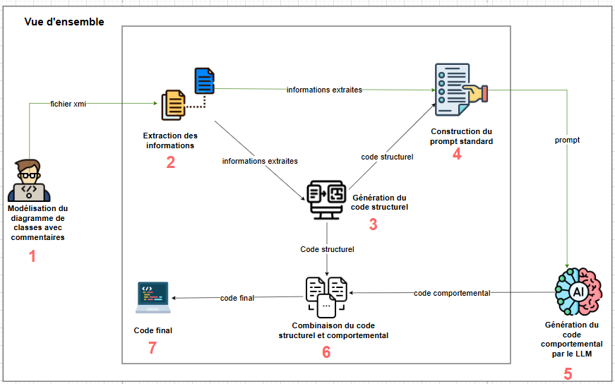

# 🧠 UML2Code-LLM

> UML2Code-LLM is a hybrid approach that automatically generates complete Java source code (structure + method bodies) from annotated UML class diagrams, combining the power of **Model-Driven Engineering (MDE)** with **Large Language Models (LLMs)** such as DeepSeek-Coder and CodeLLaMA.

---

## 🎯 Project Objective

This project aims to:

- Upload a `.xmi` UML class diagram file
- Extract structural and textual information (classes, attributes, methods, comments)
- Generate **Java structural code** (class, attributes, method signatures)
- Build a contextualized **prompt** from the UML content
- Send the prompt to a **remote LLM API** (hosted on Colab or Flask)
- Retrieve and insert **generated method bodies**, producing complete Java classes

